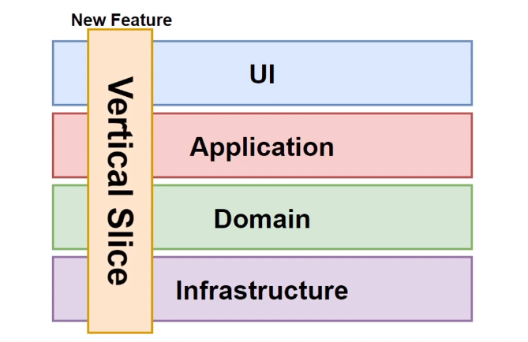
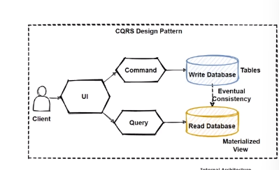
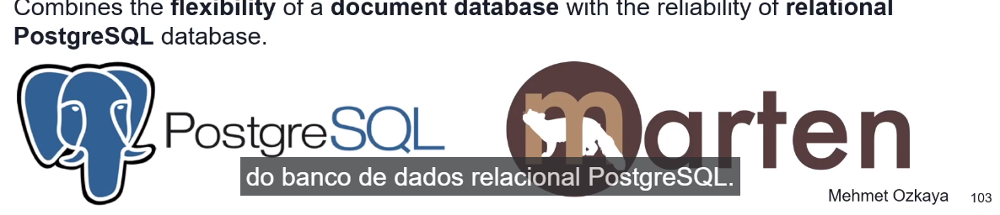

# EShopMicroservices
Aplicação desenvolvida em .NET com o objetivo de demonstrar e aplicar os conceitos da arquitetura de microserviços. A aplicação é estruturada em vários serviços independentes que se comunicam entre si, proporcionando maior escalabilidade e facilidade de manutenção. Foi utilizado .NET Core para criar serviços robustos e de alto desempenho, enquanto o API Gateway serve como ponto único de entrada, facilitando a gestão e segurança das requisições.

# Catalog.API

## Arquitetura Vertical Slice

## Design Patterns 

### CQRS Pattern

### Mediator Pattern

### Dependecy Injection

### Minimal APIs and Routing in ASP.NET 8

### ORM Pattern

## Libraries Nuget Packages

### MediatR for CQRS

### Carter for API Endpoints

### Marten for

## Uso do PostgreSQL e Marten 
Para o serviços de comunicação usando o PostgreSQL iremos utilizar a biblioteca Marten:

